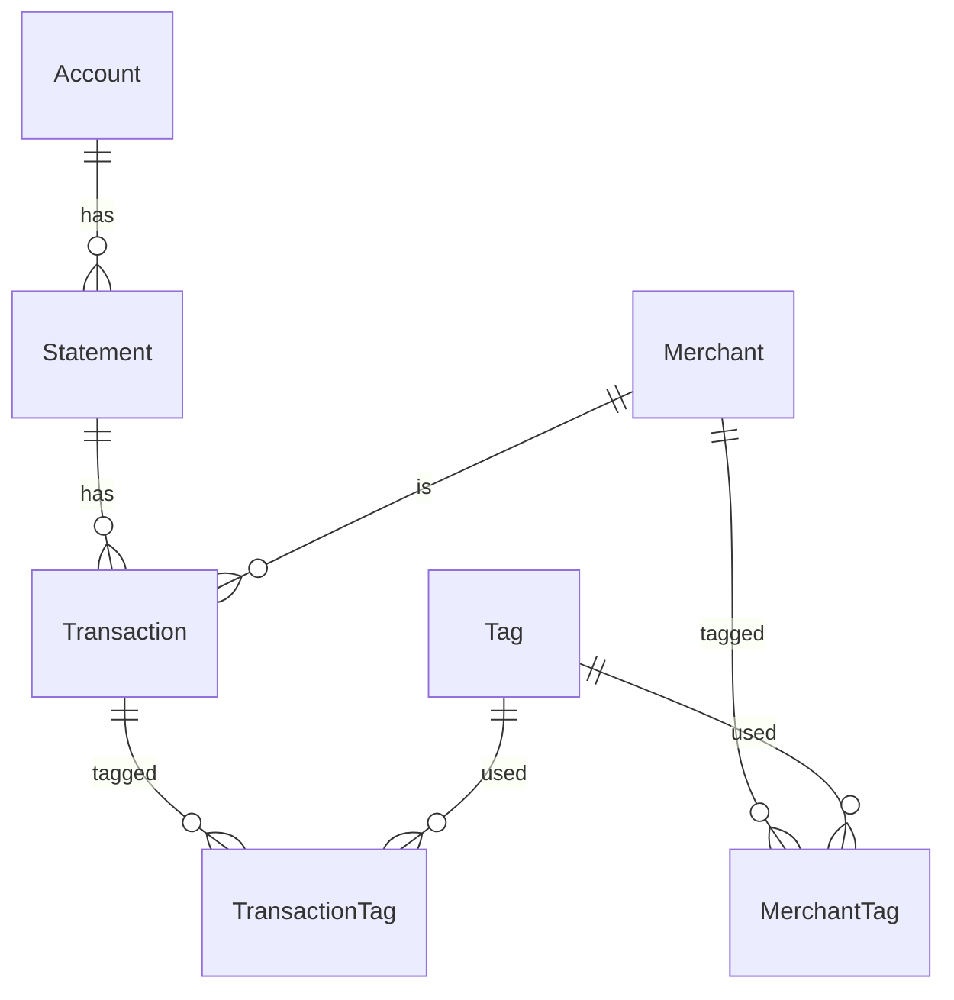

# Bank Statement Database Design (Merchant-Centric, Taggable, Analytics-Ready)

## Overview
This document describes the database schema and data model for importing, tagging, and analyzing bank statement data (parsed from PDF/text) with a focus on:
- Merchant-centric analytics
- Flexible tagging (merchants and transactions)
- Extensible, normalized structure for future-proofing

---

## Entity-Relationship Diagram

---

## Table Structure

### **Account**
- Stores bank account details.
- Linked to statements.

| Field           | Type    | Description                |
|-----------------|---------|----------------------------|
| Id              | INTEGER | Primary Key                |
| AccountNumber   | TEXT    | Account number             |
| BankCode        | TEXT    | Bank code                  |
| Name            | TEXT    | Account name               |
| IBAN            | TEXT    | IBAN                       |
| BIC             | TEXT    | BIC                        |
| Holder          | TEXT    | Account holder             |
| Address         | TEXT    | Account address            |
| Type            | TEXT    | Account type               |
| Currency        | TEXT    | Account currency           |
| Branch          | TEXT    | Branch name                |
| Contact         | TEXT    | Contact info               |

### **Statement**
- Stores statement-level data (period, balances, etc.).
- Linked to an account.

| Field           | Type    | Description                |
|-----------------|---------|----------------------------|
| Id              | INTEGER | Primary Key                |
| AccountId       | INTEGER | FK to Account              |
| PeriodStart     | DATE    | Statement period start     |
| PeriodEnd       | DATE    | Statement period end       |
| StatementNumber | TEXT    | Statement number           |
| OpeningBalance  | REAL    | Opening balance            |
| ClosingBalance  | REAL    | Closing balance            |
| TotalDebits     | REAL    | Total debits               |
| TotalCredits    | REAL    | Total credits              |
| NumDebits       | INTEGER | Number of debits           |
| NumCredits      | INTEGER | Number of credits          |

### **Merchant**
- Unique merchants/places/recipients.
- Can be tagged for analytics.

| Field              | Type    | Description                |
|--------------------|---------|----------------------------|
| Id                 | INTEGER | Primary Key                |
| Name               | TEXT    | Merchant name              |
| Address            | TEXT    | Merchant address           |
| MerchantIdentifier | TEXT    | Optional unique code       |
| Notes              | TEXT    | Freeform notes             |

### **Tag**
- Categories for merchants or transactions (e.g., Groceries, Kids, Unneeded).

| Field           | Type    | Description                |
|-----------------|---------|----------------------------|
| Id              | INTEGER | Primary Key                |
| Name            | TEXT    | Tag name (unique)          |

### **MerchantTag**
- Many-to-many: Merchants can have multiple tags.

| Field      | Type    | Description                |
|------------|---------|----------------------------|
| MerchantId | INTEGER | FK to Merchant             |
| TagId      | INTEGER | FK to Tag                  |

### **Transaction**
- Parsed transaction data, linked to statement and merchant.

| Field            | Type    | Description                |
|------------------|---------|----------------------------|
| Id               | INTEGER | Primary Key                |
| StatementId      | INTEGER | FK to Statement            |
| Date             | DATE    | Transaction date           |
| Description      | TEXT    | Description                |
| Amount           | REAL    | Amount (debit/credit)      |
| Currency         | TEXT    | Transaction currency       |
| Reference        | TEXT    | Reference (VS/SS/KS)       |
| MerchantId       | INTEGER | FK to Merchant             |
| Countervalue     | REAL    | Countervalue (if FX)       |
| OriginalCurrency | TEXT    | Original currency (if FX)  |
| ExchangeRate     | REAL    | Exchange rate (if FX)      |
| ExtraInfo        | TEXT    | Any extra details          |

### **TransactionTag**
- Many-to-many: Transactions can have multiple tags (for exceptions, splits, etc.).

| Field         | Type    | Description                |
|---------------|---------|----------------------------|
| TransactionId | INTEGER | FK to Transaction          |
| TagId         | INTEGER | FK to Tag                  |

---

## Tagging & Analytics
- **Merchant tags**: All transactions for a merchant inherit its tags for analytics (e.g., all `SUPERMARKET FRESH KOSICE` transactions are `Groceries`).
- **Transaction tags**: Individual transactions can be tagged for exceptions or splits (e.g., a one-off `Kids` expense at a grocery store).
- **Flexible grouping**: You can group, filter, and sum by tag, merchant, category, or any combination.

---

## Example Analytics Queries
- **Total spent on Groceries:**
  - Sum all transactions where the merchant is tagged `Groceries`.
- **Top merchants by category:**
  - Group by merchant and tag, order by total amount.
- **Find untagged merchants:**
  - List merchants with no tags for further review.
- **Tag exceptions:**
  - Tag individual transactions for special cases (e.g., gifts, business expenses).

---

## Summary
This schema is designed for:
- Clean separation of merchants, transactions, and tags
- Powerful, flexible analytics
- Easy extension for new categories, rules, or reporting needs

You can now proceed to implement this in SQLite and C# for robust, tag-driven expense tracking and analysis. 